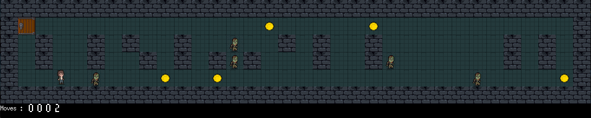
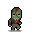

# so_long
The "so_long" project at 42 is a 2D game developed in C using the MinilibX graphical library, involving tile-based map rendering, player movement, and collision detection, where the engine handles real-time graphics, event handling, and resource management to create a visually engaging and interactive gaming experience.


## How to play
1. git clone the project
2. make bonus (or just make for the boring version)
3. ./so_long_bonus maps/map.ber

## Tutorial
### 1. Install minilibx library:
```
git clone https://github.com/42Paris/minilibx-linux.git
```
### 2. Create a Makefile
```
NAME = so_long
CFLAGS = -Wextra -Wall -Werror
SRC = your c code 
GETNEXTLINE := get_next_line/*c
OBJS = $(SRC:.c=.o)
MLX_LIB = mlx/
MLX_FLAGS = -Lmlx -lmlx -L/usr/lib/X11 -lXext -lX11

all: $(NAME)

$(NAME): $(OBJS)
	@if [ ! -d "mlx" ]; then \
	git clone https://github.com/42Paris/minilibx-linux.git mlx; \
	fi
	@make -C $(MLX_LIB)
	$(CC) $(CFLAGS) $(OBJS) $(GETNEXTLINE) $(MLX_FLAGS) -o $(NAME)

clean:
	rm -rf $(OBJS)
	rm -rf $(BONUS_OBJS)

fclean: clean
	@if [ -d "mlx" ]; then \
	make clean -C mlx/; \
	fi
	rm -f $(NAME)

re: fclean all

.PHONY: all clean fclean re
```
### 3. Make a struct to store info about the game
```
typedef s_game
{
void *mlx;
void *window;
} t_game
```
### 4. Initialize the game and open the window
```
game->mlx = mlx_init();
game->window = mlx_new_window(game->mlx, WIDTH, HEIGHT, "Your Game Title");
mlx_loop(game->mlx);
```
### 5. ESC and close button

It is done using mlx_destroy_window();
```
// function that you want to call evety time you exit the game
int	on_destroy(t_game *game)
{
	mlx_destroy_window(game->mlx, game->window);
	mlx_destroy_display(game->mlx);
	free(game->mlx);
	exit(0);
	return (0);
}

int	key_hook(int keycode, t_game *game)
{
	if (keycode == 65307)
		on_destroy(game);
	return (0);
}
mlx_key_hook(game.window, key_hook, &game); //every time a key is pressed key_hook is called
mlx_hook(game.window, 17, 0, on_destroy, &game); //if close button is pressed on_destroy is called
```
### 6. Open images
   
It is done using mlx_xpm_file_to_image();
```
void  open_ground_coins_door(t_game *game)
{
	game->textures.ground = mlx_xpm_file_to_image(game->mlx, \
	"assets/dirt.xpm", &game->width, &game->height);
	game->textures.coin = mlx_xpm_file_to_image(game->mlx, \
	"assets/coin.xpm", &game->width, &game->height);
	game->textures.door = mlx_xpm_file_to_image(game->mlx, \
	"assets/door.xpm", &game->width, &game->height);
	game->textures.wall = mlx_xpm_file_to_image(game->mlx, \
	"assets/wall.xpm", &game->width, &game->height);
}
```
### 7. Where to find and convert image

Use itch.io to find free sprites, assets and convertio.co to convert sprites into .xpm format
 
### 8. Free images

To prevent memory leaks you have to free images right before the game is closed
```
void	free_textures(t_game *game)
{
	mlx_destroy_image(game->mlx, game->textures.coin);
	mlx_destroy_image(game->mlx, game->textures.door);
	mlx_destroy_image(game->mlx, game->textures.ground);
	mlx_destroy_image(game->mlx, game->textures.wall);
}
```
### 9. Read and store map

Make a 2d array and fill it
```
void	fill_map(t_game *game, int lines, char *map)
{
	int	file;
	int	i;

	i = 0;
	file = open(map, O_RDWR); // open file
	game->map = malloc(sizeof(char *) * (lines + 1)); // allocate memory to store the map
	game->map[0] = get_next_line(file); // fill each element of the array line by line
	while (i < lines)
	{
		i++;
		game->map[i] = get_next_line(file);
	}
	close(file); // close file
}
```
### 12. Map rules

In progress
### 13. Error handling

You must display "Error\n" followed by an explicit message if a map is not valid
### 14. Valid path

There must be a valid path to the exit and every coin.

I used flood fill algoritmh to check if there is a path
```
int	validmove(t_game *game, int **visited, int row, int col)
{
	return (game->map[row][col] != '1' && !visited[row][col]); // checks if it is not a wall and if it haven t been alredy visited
}

void	floodfill(t_game *game, int row, int col, int **visited)
{
	if (!validmove(game, visited, row, col) || visited[row][col])
		return ;
	if (game->map[row][col] == 'C') // if it is a coin 
		game->flood_fill_coins += 1;
	visited[row][col] = 1; // mark areas as visited
	floodfill(game, row - 1, col, visited); // up
	floodfill(game, row + 1, col, visited); // down
	floodfill(game, row, col - 1, visited); // left
	floodfill(game, row, col + 1, visited); // right
}

void	player_position(t_game *game, int i, int *player_col, int *player_row) // function to find the player
{
	int	j;

	j = 0;
	game->flood_fill_coins = 0;
	game->coins = 0;
	while (game->map[i][j])
	{
		if (game->map[i][j] == 'P')
		{
			*player_row = i;
			*player_col = j;
			break ;
		}
		j++;
	}
}

void	exit_position(t_game *game) // function to find the exit
{
	int	j;
	int	i;

	i = 0;
	while (game->map[i])
	{
		j = 0;
		while (game->map[i][j])
		{
			if (game->map[i][j] == 'E')
			{
				game->exit_row = i;
				game->exit_col = j;
			}
			if (game->map[i][j] == 'C')
				game->coins += 1;
			j++;
		}
		i++;
	}
}

int	valid_path(t_game *game)
{
	int	i;
	int	p_row;
	int	p_col;
	int	**visited;

	visited = ft_calloc(game->map_rows, sizeof(int *)); // allocate memory to store visited areas
	i = 0;						// I use calloc to prevent uninitialised value error
	while (i < game->map_rows)
	{
		visited[i] = ft_calloc(game->map_cols, sizeof(int *));
		i++;
	}
	i = 0;
	while (game->map[i])
	{
		player_position(game, i, &p_col, &p_row); // find player position on the map
		i++;
	}
	exit_position(game); // find where exit is located on the map
	floodfill(game, p_row, p_col, visited); // start algorithm
	i = visited[p_row][p_col] && visited[game->exit_row][game->exit_col]; // if the exit area is not visited it means there is no valid path
	free_visited(visited, game); // free memory
	if (game->flood_fill_coins != game->coins || !i) // if the algorithm could not find the same amount of coins as the map has or i(exit is unreachable) is not true
		return (1);
	return (0);
}
```
### 15. Player movement

There are two ways to handle player movement. To render the whole map every time the player moves (mlx_clear_window) or to render only sprites that have changed.

I find second approach much better in terms of optimization, that is why I chose it.
```
void	move_right(t_game *game, int i, int j)
{
	if (game->map[j][i + 1] == 'C') // if it is a coin, update score
		game->score += 1;
	else if (game->map[j][i + 1] == 'E' && game->coins == game->score) // if it is an exit and the player collected all coins
		on_destroy(game);
	else if (game->map[j][i + 1] == 'E') // if it is an exit and player did not collect every coin
		return ;
	game->moves += 1; // update moves counter
	game->map[j][i] = '0'; // update map
	game->map[j][i + 1] = 'P'; // update map
	put_player(game, i + 1, j); // render player on the screen
	mlx_put_image_to_window(game->mlx, game->window, \
	game->textures.ground, 0 + i * 32, 0 + (j * 32)); // render ground on the screen
}

void	update_player_position(t_game *game, int key)
{
	int		i;
	int		j;
	char	*moves;

	i = game->x; // get player current position
	j = game->y; // get player current position
	if (key == 115 && game->map[j + 1][i] != '1') // if s is pressed and next tile is not a wall
		move_top(game, i, j);
	else if (key == 119 && game->map[j - 1][i] != '1') // if w is pressed and next tile is not a wall
		move_down(game, i, j);
	else if (key == 97 && game->map[j][i - 1] != '1') // if a is pressed and next tile is not a wall
		move_left(game, i, j);
	else if (key == 100 && game->map[j][i + 1] != '1') // if d is pressed and next tile is not a wall
		move_right(game, i, j);
}

int	key_hook(int keycode, t_game *game)
{
	if (keycode == 119 || keycode == 115 \ // if w/a/s/d is pressed
	|| keycode == 100 || keycode == 97)
		update_player_position(game, keycode);
	else if (keycode == 65307)
		on_destroy(game);
	return (0);
}
```
### 16. Moves counter on the screen

MiniLibX is not able to clean specific area of the screen, only the whole screen(mlx_clear_window). That is why mlx_string_put() is not a solution.

The only possile solution is to display the image of the digit and update it with the help of mlx_put_image_to_window()
```
void	put_digit(t_game *game, int digit, int i)
{
	if (digit == 0)
		mlx_put_image_to_window(game->mlx, game->window, \
		game->digits.zero, 100 - (i * 16), (game->map_rows + 1) * 32);
	else if (digit == 1)
		mlx_put_image_to_window(game->mlx, game->window, \
		game->digits.one, 100 - (i * 16), (game->map_rows + 1) * 32);
	else if (digit == 2)
		mlx_put_image_to_window(game->mlx, game->window, \
		game->digits.two, 100 - (i * 16), (game->map_rows + 1) * 32);
	else if (digit == 3)
		mlx_put_image_to_window(game->mlx, game->window, \
		game->digits.three, 100 - (i * 16), (game->map_rows + 1) * 32);
	else if (digit == 4)
		mlx_put_image_to_window(game->mlx, game->window, \
		game->digits.four, 100 - (i * 16), (game->map_rows + 1) * 32);
	else if (digit == 5)
		mlx_put_image_to_window(game->mlx, game->window, \
		game->digits.five, 100 - (i * 16), (game->map_rows + 1) * 32);
}

void	score(t_game *game)
{
	int	i;
	int	digit;
	int	moves;

	mlx_string_put(game->mlx, game->window, 0, \
	(game->map_rows + 2) * 32 -20, 0xFFFFFF, "Moves :"); // put "Moves" on the screen
	i = 0;
	moves = game->moves; // get the current amount of moves
	while (i < 4)
	{
		digit = moves % 10; // get last digit
		moves = moves / 10; // move to the next one
		if (digit > 5)
			put_digit_2(game, digit, i); // put digit on the screen
		else
			put_digit(game, digit, i); // put digit on the screen
		i++;
	}
}
```
18. Idle animation

```
void	right_animation(t_game *game, int width, int height)
{
	if (game->current_frame == 0 || game->current_frame == 1)
		mlx_put_image_to_window(game->mlx, game->window, \
		game->player.player_idle_right_1, 0 + width * 32, 0 + (height * 32));
	else if (game->current_frame == 2 || game->current_frame == 3)
		mlx_put_image_to_window(game->mlx, game->window, \
		game->player.player_idle_right_2, 0 + width * 32, 0 + (height * 32));
}

void	draw_frame(t_game *game)
{
	game->current_frame = (game->current_frame + 1) % 4; // divide on 4 frames for animation
	put_player(game, game->x, game->y); // put idle animation
	score(game); // display score
	usleep(270000); // wait 2,7 miliseconds
}
mlx_loop_hook(game.mlx, (int (*)(void *))draw_frame, &game); // call function draw_frame() every frame
```
